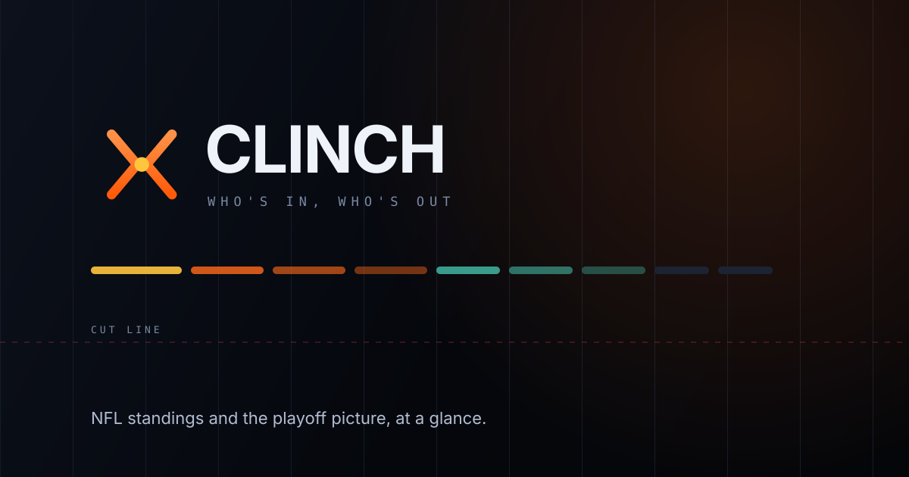

<p align="center">
  
</p>

# Clinch

**Who's in, who's out.**

NFL standings and the playoff picture on one screen. Built because the NFL
doesn't have a Bundesliga table — it has two conferences, eight divisions, four
division winners who get in regardless of record, and three wild cards who get
in because of it. Clinch shows all of that at a glance, and says plainly which
teams are in the field, which are chasing it, and which are already out.

## Features

- **Both conferences, one screen** — all eight divisions, every team, with
  records, point differential, recent form and current seed. Tap any team for
  its splits, last five results and next kickoff.
- **A playoff picture that isn't guesswork** — seeds 1–7 per conference, the
  cut line drawn as a real object, everyone still alive ranked by how many games
  back they are, and the eliminated set aside.
- **The whole bracket as a tournament tree** — both halves closing on the
  Super Bowl, with each connector lit in the colour of the team travelling along
  it. Rounds fill in **only as games are actually played**; nothing is projected.
  Tap any team to try a result of your own, and the bracket **reseeds after
  every round** exactly like the NFL does.
- **Clinched and eliminated only when the maths says so** — see
  [How the labels are derived](#how-the-labels-are-derived). Nothing here is a
  projection or a win probability.
- **Any game opens** — tap a card on the standings page, or a played game in the
  bracket, for a colour-split scoreboard, the quarter-by-quarter linescore and a
  scoring timeline that names who threw and caught every touchdown. Where the
  browser supports it, the card morphs into the dialog.
- **Any week, forwards or back** — next week's fixtures, last month's results,
  or the Wild Card round, grouped by day in your own timezone with bye teams and
  division games called out. Arrows, ← / →, or a swipe.
- **Live during games** — scores and states stream over SSE; the page never
  needs a refresh.
- **Built for a phone first** — the tables drop columns as the space narrows
  using container queries, so a card in a two-column desktop layout stays as
  readable as the same card on a 390px screen.
- **One container** — the built frontend is served by the same Express process
  as the API, and there is no database, no volume and no state on disk.

## The three views

| Route | What it's for |
| ----- | ------------- |
| `/` | **Standings.** All eight divisions under a banner showing where the season is and who leads each conference. Tap a team for its splits, last five results and next kickoff. |
| `/playoffs` | **Playoff picture.** Seeds 1–7, the cut line, everyone still chasing it ranked by games back, and the eliminated. |
| `/bracket` | **Bracket.** The tournament tree, seeded on today's standings and playable. |
| `/week/:slug` | **Schedule.** Any week of the season — `/week/5`, `/week/wild-card` — grouped by day in your own timezone, with byes, division games flagged, and every game opening the same detail modal. |

### What the week browser does and doesn't do

It changes **which games you are looking at**. The standings, seeds and bracket
always describe *now*, and any week other than the current one says so — "next
week", "3 weeks back", with a way straight back.

Standings *as of* a past week are deliberately absent. ESPN only ever exposes
the **current** `playoffSeed`; records could be recomputed from results, but
seeds could not, and inventing historical ones would break the rule the rest of
the app rests on. A week is a schedule, not a time machine for the table.

### How the bracket fills itself in

Only two things ever place a team in the bracket: **a game that was actually
played**, and **a pick you made yourself**. There is no third fallback — no
"higher seed advances" filling the tree to the Super Bowl with results nobody
played. A bracket that looks decided when nothing is decided is worse than an
empty one.

So for the whole regular season the tree shows the wild card matchups the
current seeding produces, and every later slot says where its team will come
from — *Lowest remaining seed*, *Wild card winner*, *Winner of Game 4*, *AFC
champion*. Come January those slots fill in with the real results and scores as
the rounds are played.

Two structural exceptions are worth knowing:

- **The 1 seed takes its divisional slot immediately.** That's a rule, not a
  prediction — a bye means they play in the divisional round whatever happens.
- **The divisional round needs the whole wild card weekend.** The 1 seed draws
  the lowest remaining seed, so two of three results settle nothing; the round
  stays blank until all three are in.

Picking a winner re-runs the bracket underneath it, reseed included, and is
marked `PICK` so it never reads as a result. A pick that no longer names a team
in its match — because you changed something upstream — is ignored rather than
having to be cleared.

## Local development

```bash
npm run install:all
npm run dev
```

Client: **http://localhost:5176**. API: `http://localhost:4600` (proxied
through `/api` in dev, same-origin in production — no CORS config either way).

## Deploying (Docker)

```bash
docker compose up -d --build
```

Then point the Cloudflare Tunnel's public hostname at container port `4600`.
Clinch has no hardcoded origin assumptions and stores nothing, so the container
is disposable — restarting it just re-pulls the league.

### Environment variables

| Variable                  | Default   | Purpose                                                    |
| ------------------------- | --------- | ---------------------------------------------------------- |
| `PORT`                    | `4600`    | Port the server listens on.                                 |
| `CLINCH_SEASON`            | *(live)*  | Pin a season (e.g. `2025`) instead of following the current one. |
| `CLINCH_REFRESH_MS`        | `120000`  | Refresh cadence when nothing is being played.               |
| `CLINCH_LIVE_REFRESH_MS`   | `25000`   | Refresh cadence while a game is in progress.                |
| `CLINCH_SCHEDULE_TTL_MS`   | `3600000` | How long a future week's schedule is trusted before re-fetching. |
| `CLINCH_TIMEOUT_MS`        | `12000`   | Per-request timeout against the upstream feed.              |

## Where the data comes from

ESPN's public NFL endpoints — `standings?level=3` for the division tables,
`scoreboard` for schedule and scores (including the postseason rounds that fill
the bracket in), and `summary?event=` behind `/api/game/:id` for a single game's
detail. No key, no account, no scraping.

That last one is ~590 kB per game. The server trims it to ~3 kB by dropping the
21 team stats the UI doesn't show, the per-player boxscores, drives, win
probability, news and video — so a modal costs a browser about as much as a
photograph, not half a megabyte of JSON it would throw away.

The server polls them, keeps the result in memory and serves every client from
that one copy, so the number of people looking at the page has no bearing on how
often ESPN gets asked. Weeks that have finished are never re-fetched, which is
why steady-state traffic is a single request per cycle.

Two things are taken from ESPN as authoritative rather than recomputed:

- **`playoffSeed`** — the conference seed, with the NFL's full tiebreaker chain
  (head-to-head, common games, strength of victory…) already applied. Clinch
  sorts by it rather than reimplementing tiebreakers it would get subtly wrong.
- **Division membership order** is *not* taken from ESPN — it returns division
  entries in its own order, which is not the standings order. Divisions are
  sorted by seed instead, which puts the real leader first.

Teams that haven't kicked off yet come back with `playoffSeed: 0`, which would
otherwise sort them above the entire conference. Those are slotted in by win
differential and the whole conference renumbered — a no-op from the moment every
team has played once.

## How the labels are derived

Every status is settled arithmetic, never a projection. A win counts 1 and a tie
counts ½, so ties stop being a special case; `floor` is the record a team ends on
if it loses out, `ceiling` the record if it wins out.

| Label | Condition |
| ----- | --------- |
| **Eliminated** | The team's ceiling is below the current 7th seed's floor. At least seven teams are already at or above that mark and none of them can lose ground, so the chase is over. |
| **Clinched berth** | The team's floor is above the ceiling of all nine teams currently outside the cut. It finishes ahead of every one of them, so at worst it is the 7 seed. |
| **Clinched division** | The team's floor is above the ceilings of its three division rivals. |
| **Clinched bye** | Clinched the division, and its floor is above every other ceiling in the conference. |
| **On the bubble / In the hunt / Long shot** | Outside the cut by ≤1 / ≤3 / more games. |

These are *sufficient* conditions, not exhaustive ones — a team can be eliminated
in ways this doesn't catch, since that needs full schedule analysis. Clinch
under-claims on purpose: it will occasionally be late to call a team out, and it
will never call one out wrongly.

One thing deliberately not read off the seed number: whether a team is a division
winner or a wild card. Seeds 1–4 are usually the four division leaders, but that
only holds once every team has played, so the role comes from the team's actual
position in its own division.

The bracket applies the same care to reseeding. Its lines are drawn for the
common case — the bye sits next to the 4v5 winner, giving 1v4 and 2v3. But the
NFL reseeds, and after an upset the 1 seed draws whichever survivor is seeded
lowest, which may not be the one the drawn line points at. When that happens the
round says so rather than quietly showing the wrong pairing.

## Tech stack

- **Server**: Node.js, Express, TypeScript, Server-Sent Events. No database, no
  files, no state — an in-memory cache in front of a public API.
- **Client**: React 19, TypeScript, Vite, Tailwind CSS v4. No UI framework, no
  animation library, no icon package; fonts and logos are served locally, so the
  page makes no third-party requests at all.

## Project structure

```
clinch/
├── brand/                  standalone brand assets (mark, logo, banner)
├── server/src/
│   ├── config.ts           env vars
│   ├── espn.ts             upstream client + response normalisation
│   ├── derive.ts           seeding, clinch/elimination, the bracket
│   ├── snapshotStore.ts    poll loop, week cache, SSE fan-out
│   ├── teams.ts            the 32 teams: division, and a dark-legible accent
│   ├── index.ts            API, SSE, static serving
│   └── types.ts
├── client/public/
│   ├── fonts/              two variable woff2 files, self-hosted
│   └── logos/              32 team marks, 160px webp, ~230 kB total
├── client/src/
│   ├── components/         Header, SeasonHero, DivisionCard, TeamRow, SeedRow,
│   │                       BracketTree, BracketConnectors, SuperBowlCard…
│   ├── hooks/              useSnapshot (SSE), useRoute, useMediaQuery
│   └── lib/                types, status ladder, bracket resolver, formatting
├── Dockerfile              multi-stage build → single runtime image
└── docker-compose.yml
```

## What this deliberately doesn't do

- **No win probabilities or playoff odds.** Those need a simulation and a model,
  and a number like "63%" invites more trust than it earns. Clinch shows what is
  true right now and what is already settled.
- **No tiebreaker reimplementation.** ESPN's seed is used as given.
- **No accounts, favourites or notifications.** It's a page you open on a Sunday
  evening, read in ten seconds and close.
- **No projected bracket.** See
  [How the bracket fills itself in](#how-the-bracket-fills-itself-in).
